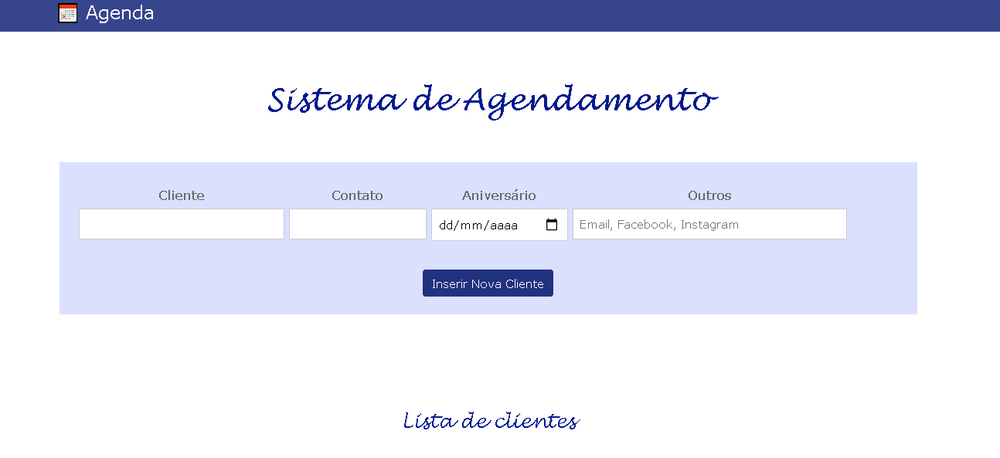
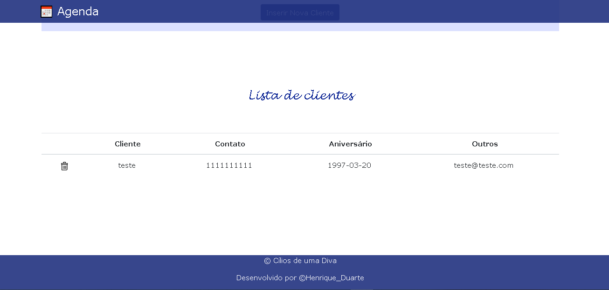

<h1>&#128198; Sistema de Agendamento</h1>

Este sistema demonstra um CRUD realizado com Node e Mysql, alem de bibliotecas e frameworks como Bootstrap para estilização, Sequelize para conexão com o banco e Handlebars para templates estáticos

<h2>Requisitos</h2>

- Node.js;

- Banco de Dados Mysql;

<h2>Instalação local</h2>

Dentro do diretorio, Deve ser feito a instalação das dependencias com o seguinte comando:

<i>- npm install;</i> 

Para configurar o banco, ir no diretorio "bd_agendamento" e editar o arquivo "conexão_bd.js", e dentro da constante <b>"sequeliza"</b>, informar o nome do banco que deseja, alem de usuario e senha.

<h2>Iniciando servidor</h2>

Para iniciar, deve ser executado o arquivo app.js com o seguinte comando:

<i>- nodemon app.js;</i>

<h2>Orientações</h2>

- Por padrão, no arquivo "app.js" a aplicação estará configurada para escutar a porta 8080, podendo ser customizada caso a porta já esteja sendo utilizada;

- Ao iniciar na pagina http://localhost:8080/, existe a possibilidade de inserir um novo horario na agenda, informando o nome do cliente, data desejada, horario, procedimento opcional de aplicação ou manutenção, após adicionar, este horario estará disponivel em "consultar agenda", onde é possivel filtrar por intervalo de data, ou se pesquisar em branco, irá buscar todos os horarios; Para deletar os horarios, basta clicar no icone de lixeira;

- Na aba Clientes, ira ser direcionado para inserir no banco, uma lista de todas as clientes para controle de contato, onde é possivel adicionar a cliente, contato, Aniversario e outros meios de comunicação;

 
- Na mesma pagina, ja estará disponivel para vizualizar, para deletar a cliente, basta clicar no icone de lixeira; 

 